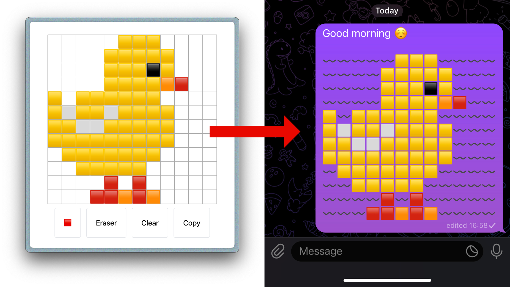

# EmojiCanvas

**WIP**. EmojiCanvas is a small web app that lets you draw with emojis and then export the result as text, so you can send your beautiful emoji art to your friend. It is available on https://rmuratov.github.io/emojicanvas/.



## Development

Clone and `cd`to project folder and then run:

```shell
npm ci
npm run dev
# go to http://localhost:5173/emojicanvas/
```

## TODO

- [x] Basic drawing
- [x] Emoji picker
- [x] Clear action
- [x] Eraser
- [x] Export/Copy tool
- [ ] Fast switch back to current brush (do not open picker every time)
- [ ] More tools: fill, line, rectangle, circle
- [ ] Better alignment of emojis. [See details](#better-positioning-on-the-canvas).
- [ ] Better solution for filler. [See details](#filler).
- [ ] Import/Save.
- [ ] Option to trim surrounding empty space while exporting.

### Better positioning on the canvas

Right now, the drawing looks acceptable only on desktop browsers on macOS (Apple-style emojis). On other OSes, emojis might have different widths and heights; hence, they can overflow their cells, and the overall painting would look ugly. A better approach should be implemented to address these inconsistencies (meaning, preferably, no hard-coded imperative by-pixel positioning).

### Filler

As emoji artists, we want to leave empty spaces in our drawings. At the same time, we want to preserve the position of every other emoji on our canvas. We need something that has the same width as an emoji, but invisible. What should be used to represent empty spaces?

* Space. The obvious option, but unfortunately messaging apps trim them, so our art falls apart.
* Some other invisible symbol. I tried a lot, and [Halfwidth Hangul Filler](https://www.compart.com/en/unicode/U+FFA0) repeated three times was the closest to the desired behavior but not ideal. Maybe I should examine more such symbols and their combinations.
* Other emoji symbol, that do not occupy much space. This is where I stop. Right now, EmojiCanvas uses 〰️ as a filler. It could use ➖, but 〰️ looks funnier.
ﾠﾠﾠﾠﾠﾠﾠﾠﾠﾠﾠ