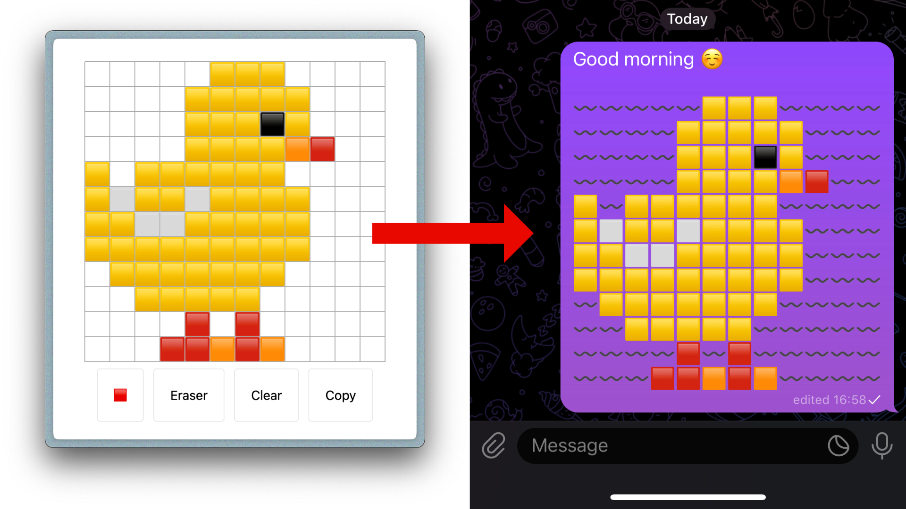

# EmojiCanvas

**WIP**. EmojiCanvas is a small web app that lets you draw with emojis and then export the result as text, so you can send your beautiful emoji art to your friend. It is available on https://rmuratov.github.io/emojicanvas/.



## Development

Clone and `cd`to project folder and then run:

```shell
npm ci
npm run dev
# go to http://localhost:5173/emojicanvas/
```

## TODO

- [x] Basic drawing
- [x] Emoji picker
- [x] Clear action
- [x] Eraser
- [x] Export/Copy tool
- [x] Better alignment of emojis
- [x] Option to trim surrounding empty space while exporting
- [x] Undo/redo
- [x] Pan and zoom on an unbounded canvas
- [ ] Fast switch back to current brush (do not open picker every time)
- [ ] More tools: fill, line, rectangle, circle
- [ ] Better solution for filler. [See details](#filler).
- [ ] Import/Save.

### Positioning on the canvas

This used to look acceptable only on macOS, where the Apple emoji metrics happened to
match the hard-coded per-glyph pixel nudges; elsewhere glyphs overflowed their cells.
Each glyph is now measured and centred on its own bounding box, and shrunk if it would not
fit, so no by-pixel constants are involved and emoji with a variation selector line up
with native ones.

### Filler

As emoji artists, we want to leave empty spaces in our drawings. At the same time, we want to preserve the position of every other emoji on our canvas. We need something that has the same width as an emoji, but invisible. What should be used to represent empty spaces?

* Space. The obvious option, but unfortunately messaging apps trim them, so our art falls apart.
* Some other invisible symbol. I tried a lot, and [Halfwidth Hangul Filler](https://www.compart.com/en/unicode/U+FFA0) repeated three times was the closest to the desired behavior but not ideal. Maybe I should examine more such symbols and their combinations.
* Other emoji symbol, that do not occupy much space. This is where I stop. Right now, EmojiCanvas uses 〰️ as a filler. It could use ➖, but 〰️ looks funnier.
ﾠﾠﾠﾠﾠﾠﾠﾠﾠﾠﾠ